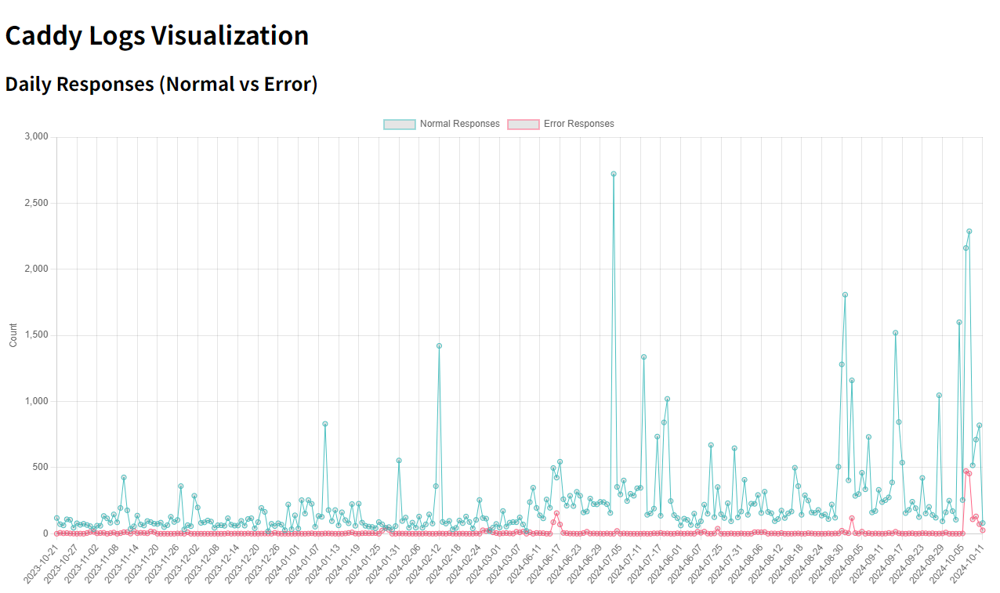

# Caddyログ解析ツール

このツールは、Caddyウェブサーバーのログを解析し、ウェブサイトへのアクセス状況や潜在的な攻撃を可視化するツールです。 



## 特徴

* CaddyのJSON形式のログファイルを解析
* 日ごとの正常なリクエストとエラーリクエスト数を集計
* 不審なIPアドレス（404エラーを多数発生させたIPアドレス）を検出
* 不審なIPアドレスの国情報を取得
* WordPressへの攻撃パスを検出
* 解析結果をJSONファイルとグラフで出力

## ファイルツリー

```
.
├── analyzer.py         # ログ解析を行うPythonスクリプト
├── index.html          # 解析結果を表示するHTMLファイル
├── untargz.py          # 圧縮されたログファイルを解凍するPythonスクリプト
├── caddy-logs          # 圧縮されたCaddyログファイルを配置するディレクトリ (初期状態では空)
└── raw-caddy-logs     # 解凍されたCaddyログファイルを配置するディレクトリ (初期状態では空)
```

## インストール方法

1. このリポジトリをクローンします。

```bash
git clone https://github.com/takoyaki-3/caddy-log-analyzer.git 
cd caddy-log-analyzer
```

## 使い方

1. 圧縮されたCaddyログファイルを `caddy-logs` ディレクトリに配置します。

2. `untargz.py` を実行してログファイルを解凍します。

```bash
python untargz.py
```

スクリプトを実行すると、ドメイン名を入力するように求められます。解析対象のドメイン名を入力してください。

3. `analyzer.py` を実行してログファイルを解析します。

```bash
python analyzer.py
```

これにより、`raw-caddy-logs` ディレクトリ内のログファイルが解析され、`caddy_logs_summary_with_countries.json` というファイルに解析結果が出力されます。

4. `index.html` をブラウザで開きます。

`live share`などの拡張機能によりWebサーバーを立て、`index.html` をブラウザで開きます。
`index.html` は、`caddy_logs_summary_with_countries.json` ファイルを読み込み、日ごとのリクエスト数と国別の攻撃数をグラフで表示します。

## APIエンドポイント

このツールは外部APIを使用します。

* `http://ip-api.com/json/{IPアドレス}?fields=country` : IPアドレスから国情報を取得するために使用します。

## コマンド実行例

```bash
# 圧縮されたログファイルを解凍
python untargz.py

# ログファイルを解析
python analyzer.py
```

## ライセンス

このプロジェクトはMITライセンスで公開されています。 詳しくは `LICENSE` ファイルをご覧ください。